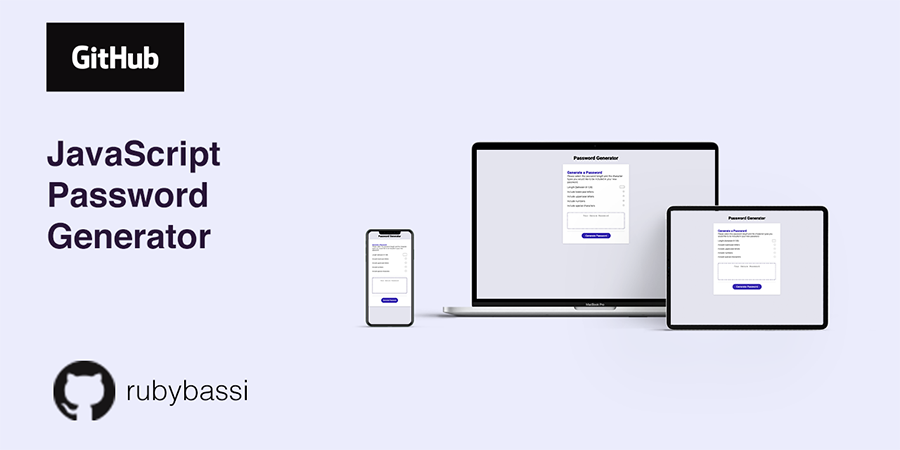

# Javascript: Password Generator

## Background

This project is my attempt of creating a random password generator application. The app runs in the browser and features dynamically updated HTML and CSS powered by JavaScript code. I also ensured the HTML elements followed a semantic structure and that the site was responsive through the use of CSS media queries. Comments were added throughout the Javascript file, highlighting the key coding blocks and evidence of console.log testing. 

[View my final project on GitHub pages](https://rubybassi.github.io/cool-password-generator/)

If you have feedback, please feel free to drop me a comment.

### User Story

> AS AN employee with access to sensitive data
> I WANT to randomly generate a password that meets certain criteria
> AS AN employee with access to sensitive data

### Acceptance Criteria

> GIVEN I need a new, secure password
> WHEN I click the button to generate a password
> THEN I am presented with a series of prompts for password criteria
> WHEN prompted for password criteria
> THEN I select which criteria to include in the password
> WHEN prompted for the length of the password
> THEN I choose a length of at least 8 characters and no more than 128 characters
> WHEN prompted for character types to include in the password
> THEN I choose lowercase, uppercase, numeric, and/or special characters
> WHEN I answer each prompt
> THEN my input should be validated and at least one character type should be selected
> WHEN all prompts are answered
> THEN a password is generated that matches the selected criteria
> WHEN the password is generated
> THEN the password is either displayed in an alert or written to the page

### Expected Layout Mockup

The following image was provided to demonstrate what the web application's layout should resemble, although there was room for customisation:

### My Development Enviromment:
* [Visual Studio Code](https://code.visualstudio.com/)
* Terminal
* [Git](https://git-scm.com/book/en/v2/Getting-Started-Installing-Git)
